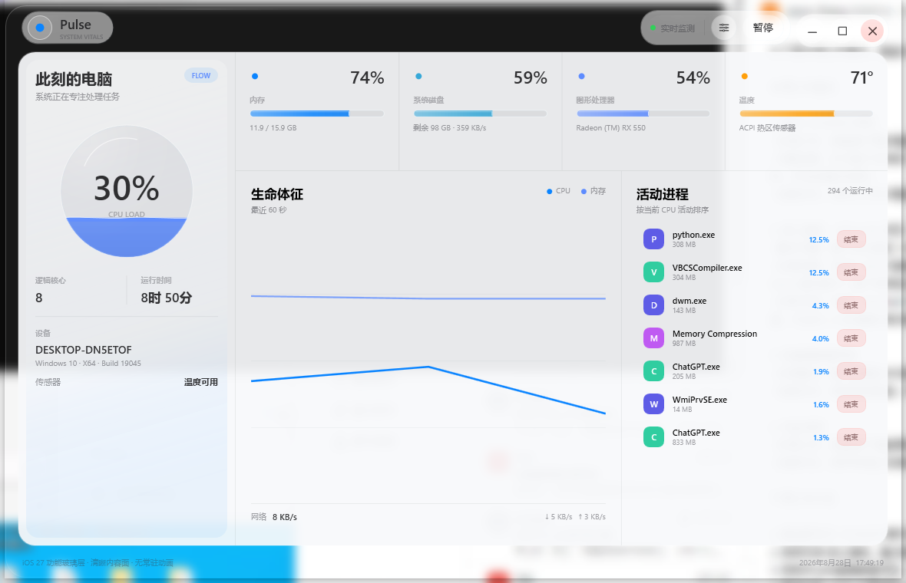
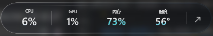

# Pulse

Pulse is a lightweight system monitoring panel for Windows 10/11. Its visual hierarchy follows the 2026 iOS 27 UI Kit: transparent glass is used for floating controls, while monitoring data remains on a stable, readable surface.

## Preview

### Full monitoring panel



### Compact liquid-digit OSD

Minimizing the main window switches to a compact, draggable, always-on-top on-screen display (OSD) that does not steal focus.



## Features

- CPU, GPU, memory, system disk, network, and ACPI temperature monitoring
- A liquid-style circular CPU gauge and lightweight capsule gauges for memory, disk, GPU, and temperature, with subtle caustic highlights along the liquid surface
- CPU and memory trend charts covering the last 60 seconds
- A native process activity list, with confirmation and system-process protection for ending a process
- An always-on-top CPU, GPU, memory, and temperature OSD when the main window is minimized
- A compact dark-glass OSD with four liquid-filled numeric readouts; the fill level appears inside the digits
- An Optical Material panel with automatically saved glass transparency and edge optics settings
- Separately spaced minimize, maximize, and close controls that match the interface

## Glass rendering

- The window uses native DWM Clear Blur Behind so the colors of windows behind it remain visible, without taking desktop screenshots.
- Edge optics add a bright inner rim, subtle blue-violet dispersion, specular highlights, and edge thickness. They do not resample background pixels or produce dark borders at the highest setting.
- Pointer highlights, inner-edge dispersion, and specular highlights share one light-source position. Updates are coalesced at 66 ms intervals only when edge optics are enabled and the pointer has moved enough; there is no continuous animation loop.
- Glass transparency affects the shell, control groups, and OSD while keeping text, charts, processes, and buttons readable.
- The optical settings overlay maintains higher contrast against complex desktop backgrounds so its sliders and values remain legible.

## Performance

- Core metrics are sampled in the background every 2 seconds. The UI thread receives prepared snapshots.
- Main-window liquid gauges use persistent vector layers. OSD liquid digits redraw only the small filled area inside each glyph when samples change; they use no wave timer or continuous animation.
- Numeric readouts update every 2 seconds. Liquid-level changes are coalesced to at most one update every 4 seconds, with immediate updates for changes of 6% or more.
- Frequently used gradients, highlights, and outline brushes are frozen and reused instead of being recreated every frame.
- GPU usage is collected through one native PDH wildcard query across all engines, rather than a separate performance counter for each instance.
- The process list uses `NtQuerySystemInformation` to obtain one native snapshot. It appears immediately at startup and refreshes every 30 seconds.
- Ending a process or returning from the OSD triggers an immediate process-list refresh when needed.
- Mini OSD mode stops disk, network, and process-list sampling and keeps only its four required metrics.
- The desktop compositor handles transparency, while lightweight frozen vector brushes provide edge optics. The application does not run a desktop screenshot loop or continuously update a WPF blur shader.

## Usage

Double-click `Pulse.exe`, or use the launcher `启动 Pulse.bat` (Launch Pulse).

- The minimize button switches to the mini OSD instead of minimizing to the taskbar.
- Drag the OSD to reposition it. Click the expand control at the end of the capsule, or double-click an empty area, to return to the full panel.
- Percentage fill levels match the displayed values. Temperature fill maps to `30–100°C`, turns warm orange at 75°C, and turns red at 88°C. The fill resets to zero when the sensor is unavailable.
- Click the optics icon next to the pause button to adjust Glass Transparency and Edge Optics. At `0`, the edge setting keeps a basic bright outline; at `100`, it applies the strongest inner-edge effect without a black border.
- The End Process control is disabled for Pulse itself and core system processes. Windows may also deny access to other protected processes.
- Some motherboards do not expose temperature through standard Windows interfaces. In that case the temperature reads `--°`, while other metrics continue to work.

## Files

- `Pulse.exe`: self-contained, single-file Windows x64 release
- `Pulse.settings.json`: generated after optical settings are changed; preserved when updating the application
- `Pulse.crash.log`: generated only after an unhandled exception
- `启动 Pulse.bat`: shortcut launcher
- `src`: complete source code for further development
- `.build/dotnet-sdk`: the local .NET SDK used by the project

Keep the project files together in the repository directory. The project does not depend on temporary source or build folders on the desktop.

## Build

From the repository root, using the local SDK at `.build/dotnet-sdk`:

```powershell
& '.\.build\dotnet-sdk\dotnet.exe' publish '.\src\DemoApp.csproj' -c Release -r win-x64 --self-contained true -p:PublishSingleFile=true
```

See `THIRD-PARTY-NOTICES.md` for third-party sources and licensing information.
